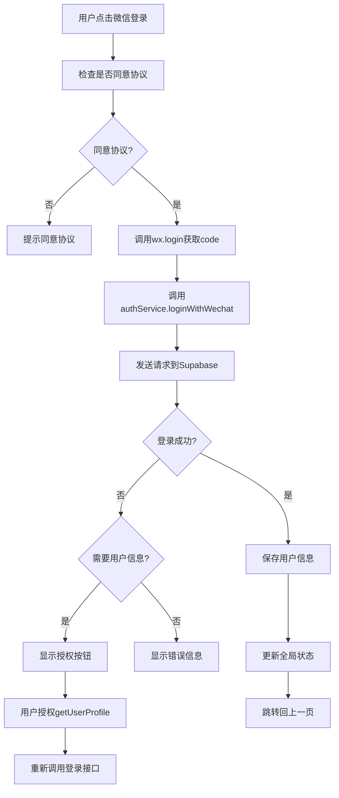

# 微信登录集成说明

## 概述

已成功将微信官方登录方法与Supabase后端集成，实现了符合微信最新规范的用户认证系统。

## 集成内容

### 1. 后端集成 (Supabase)

#### 数据库表结构
- ✅ **users表**: 存储用户基本信息、微信OpenID、ORCID等
- ✅ **RLS权限策略**: 确保用户数据安全
- ✅ **微信登录RPC函数**: `wechat_login()` 处理微信code换取用户信息

#### 认证流程
```
微信小程序 → wx.login() → 获取code → 调用Supabase RPC → 
返回用户信息和access_token → 保存到本地存储 → 更新全局状态
```

### 2. 前端集成 (微信小程序)

#### 文件结构
```
miniprogram/
├── services/
│   └── auth.service.js      # 认证服务
├── utils/
│   └── iconManager.js       # 图标管理器
├── config/
│   └── supabase.config.js   # Supabase配置
├── pages/login/
│   ├── login.wxml          # 登录页面UI（已更新）
│   ├── login.js            # 登录逻辑（已更新）
│   └── login.wxss          # 登录样式（已更新）
└── app.js                  # 全局应用（已更新）
```

#### 登录方式
1. **静默登录**: 仅获取OpenID，不需要用户授权
2. **授权登录**: 获取用户头像、昵称等信息（需用户主动授权）

### 3. 核心功能

#### AuthService 认证服务
- `loginWithWechat()` - 微信登录
- `logout()` - 用户登出
- `checkLoginStatus()` - 检查登录状态
- `bindOrcid()` - 绑定ORCID学术身份
- `updateAcademicFields()` - 更新学术领域偏好

#### IconManager 图标管理器
- 统一管理SVG图标资源
- 支持云端和本地图标切换
- 预加载常用图标
- 按分类获取图标

## 配置步骤

### 1. 获取Supabase配置

1. 登录您的Supabase控制台
2. 获取项目URL和匿名密钥
3. 更新 `miniprogram/config/supabase.config.js` 中的配置：

```javascript
const config = {
  supabaseUrl: 'https://your-project.supabase.co',
  supabaseAnonKey: 'your-anon-key-here'
}
```

4. 同时更新 `miniprogram/app.js` 中的全局配置：

```javascript
globalData: {
  supabaseUrl: 'https://your-project.supabase.co',
  supabaseAnonKey: 'your-anon-key-here'
}
```

### 2. 微信小程序配置

1. 在微信公众平台配置小程序域名白名单：
   - `https://your-project.supabase.co`

2. 确认小程序基础库版本 ≥ 2.10.4（支持 getUserProfile）

### 3. 测试登录流程

1. 运行小程序
2. 进入登录页面
3. 同意用户协议
4. 点击"微信登录"
5. 根据需要授权获取用户信息

## 登录流程图



## API接口

### 微信登录接口
```javascript
// 调用方式
const result = await authService.loginWithWechat({
  needUserInfo: false // 是否需要用户信息
})

// 返回格式
{
  success: true,
  user: {
    id: "uuid",
    wechat_openid: "wx_xxx",
    username: "用户昵称",
    avatar_url: "头像URL",
    role: "user",
    orcid: null,
    academic_field: {"fields": []},
    created_at: "2024-01-01T00:00:00Z"
  }
}
```

### Supabase RPC函数
```sql
-- 函数签名
wechat_login(
  wechat_code TEXT,           -- 微信登录code
  user_info JSONB DEFAULT NULL -- 用户信息（可选）
)

-- 返回字段
id, wechat_openid, username, avatar_url, role, 
orcid, academic_field, created_at, access_token
```

## 安全考虑

1. **数据加密**: 用户敏感信息在传输和存储时都进行加密
2. **权限控制**: 使用Supabase RLS确保用户只能访问自己的数据
3. **Token管理**: access_token有过期机制，支持自动刷新
4. **输入验证**: 对所有用户输入进行验证和过滤

## 扩展功能

### 已实现
- ✅ 微信静默登录
- ✅ 用户信息授权获取
- ✅ ORCID学术身份绑定
- ✅ 学术领域偏好设置
- ✅ 游客模式支持

### 待扩展
- [ ] 手机号登录
- [ ] 邮箱登录
- [ ] 第三方登录（GitHub、Google等）
- [ ] 多设备同步
- [ ] 登录安全日志

## 常见问题

### Q1: 登录失败，提示网络错误
**A**: 检查Supabase URL和密钥配置是否正确，确认网络连接正常。

### Q2: 获取不到用户信息
**A**: 确认使用的是 `getUserProfile` 而不是已废弃的 `getUserInfo`。

### Q3: RLS权限错误
**A**: 检查Supabase中的RLS策略是否正确设置，确认用户有相应的访问权限。

### Q4: 测试环境下无法登录
**A**: 在开发工具中可能需要勾选"不校验合法域名"选项。

## 技术支持

如有问题，请参考：
1. [微信小程序登录官方文档](https://developers.weixin.qq.com/miniprogram/dev/framework/open-ability/login.html)
2. [Supabase认证文档](https://supabase.com/docs/guides/auth)
3. 项目内的代码注释和错误日志